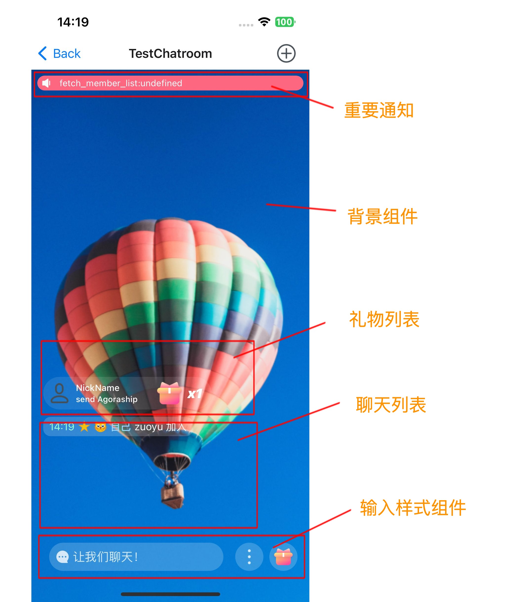

## 项目概述

该项目为 `Agora Chatroom UIKit SDK`, 简称 `UIKit`。在 `Agora Chat SDK` 基础上提供了聊天室 UI 组件的集合。可以帮助用户更快的搭建聊天室应用。

## 最低要求

使用该项目的要求：

- MacOS 12 或以上版本
- React-Native 0.66 或以上版本
- NodeJs 16.18 或以上版本

对于 `iOS` 应用：

- Xcode 13 或以上版本，以及它的相关依赖工具。

对于 `Android` 应用：

- Android Studio 2021 或以上版本，以及它的相关依赖工具。

## 项目结构

项目的主要结构如下：

```sh
.
├── biz // 含有业务的UI组件, 例如：聊天室一级组件、成员列表二级组件等。
├── config // 全局配置服务，例如：是否激活 `UIKit` 日志。
├── container // UIKit 入口 组件
├── dispatch // 事件分发服务，可以在联系紧密的组件间发送接收通知。
├── error // 错误对象，提供统一的错误码。
├── hook // Function组件工具，Class组件无法使用。
├── i18n // 国际化服务
├── room // Agora Chat SDK 服务，提供更加便捷的使用，提供统一的错误处理。
├── theme // 主题服务，提供light和dark主题，可以自定义基本色。
├── ui // 基础 UI 组件，其它高级组件的基础支撑，支持主题。
└── utils // 工具集合
```


## 命名约定

组件也是有多种分类的，根据 React-Native 的使用习惯，这里列举说明主要的命名约定。

- index.tsx 为对象的导出文件
- types.tsx 为类型声明的导出文件
- const.tsx 为常量文件，通常不对外
- Context：为数据共享的上下文对象。主题、国际化等都是通过该方式提供服务的。
- Provider：为数据共享的提供者对象
- Consumer：为数据共享的消费者对象
- Container：为 `UIKit` 的入口组件。集成了所有其他内部提供的服务和组件，使用者需要首先使用该组件进行初始化等操作。
- use 开头的：hook 工具，Function 组件使用，Class 组件不能使用。本 `UIKit` 主要以 `Function` 组件为主。
- 后缀 Props：为 UI 组件的参数类型
- 后缀 Memo：为 UI 带缓存的组件的类型
- 后缀 Ref：为 UI 组件的引用，可以控制组件行为。例如：获取焦点、显示模态窗口。
- 后缀 Model：为 UI 组件的参数里面的数据类型。
- 后缀 Service：为非 UI 组件。提供一定服务。例如：RoomService。

## 组件概览

`Chatroom UIKit SDK` 的组件大体划分为 UI 组件和非 UI 组件。 UI 组件主要用来显示内容，非 UI 组件主要完成具体功能。
从使用者的角度来说可以分为直接使用的组件和间接使用的组件，例如，`Chatroom`组件是直接使用的组件，`ParticipantList`组件是间接使用的组件。
从组件构成的角度上说，组件又可以分为顶级组件、业务组件和基础组件。例如，`Chatroom` 组件就顶级组件，`MessageList`是业务组件，`SlideModal`是基础组件。
从组件的大小的角度又可以划分为页面级组件和非页面级组件。页面级组件会占用整个屏幕的大小。例如：`Chatroom`组件是页面级组件，其它为非页面级组件，
还有一类特殊的组件，他们无法和其它同类组件共存，他们是 `Modal`组件。
还有一些组件对约束是有要求的。例如：`ScrollView` 需要指定高度，或者父类有确定的高度。



| UI 基础通用组件 | Function/Class   | 是否基础 | 是否页面 | 是否弹出 | 位置 | 大小 | 样式 | 控制 | 自定义 | 说明                                                |
| --------------- | ---------------- | -------- | -------- | -------- | ---- | ---- | ---- | ---- | ------ | --------------------------------------------------- |
| Text            | Function         | ✅       | ❌       | ❌       | ✅   | ✅   | ✅   | ❌   | ✅     | 文本基础组件：接近原生，支持主题                    |
| TextInput       | Function         | ✅       | ❌       | ❌       | ✅   | ✅   | ✅   | ✅   | ✅     | 文本输入基础组件：原生 android 无法符合设计要求     |
| TabPage         | Function         | ✅       | ❌       | ❌       | ✅   | ✅   | ✅   | ❌   | ❌     | tab 页面组件：原生没有,新增支持懒加载               |
| Modal           | Function         | ✅       | ❌       | ✅       | ✅   | ✅   | ✅   | ✅   | ✅     | 模态组件：原生不符合设计要求,增加非模态的相似组件。 |
| Image           | Function & Class | ✅       | ❌       | ❌       | ✅   | ✅   | ✅   | ❌   | ✅     | 图片组件：接近原生，自定义失败处理                  |
| Button          | Function         | ✅       | ❌       | ❌       | ✅   | ✅   | ✅   | ❌   | ❌     | 按钮组件：接近 Pressable，支持主题                  |
| FlatList        | Function         | ✅       | ❌       | ❌       | ✅   | ✅   | ✅   | ✅   | ✅     | 原生没有错误页面和加载页面。                        |

| UI 基础复合组件 | Function/Class | 是否基础 | 是否页面 | 是否弹出 | 位置 | 大小 | 样式 | 控制 | 自定义 | 说明                           |
| --------------- | -------------- | -------- | -------- | -------- | ---- | ---- | ---- | ---- | ------ | ------------------------------ |
| Alert           | Function       | ✅       | ❌       | ✅       | ❌   | ❌   | ❌   | ❌   | ❌     | 警告框组件：原生不符合设计要求 |
| Avatar          | Function       | ✅       | ❌       | ❌       | ✅   | ✅   | ✅   | ❌   | ❌     | 头像：如果失败，加载默认头像   |
| GiftIcon        | Function       | ✅       | ❌       | ❌       | ✅   | ✅   | ✅   | ❌   | ❌     | 礼物：如果失败，加载默认       |
| BottomSheetMenu | Function       | ✅       | ❌       | ✅       | ❌   | ❌   | ✅   | ✅   | ❌     | 上下文菜单：模态               |
| Placeholder     | Function       | ✅       | ❌       | ❌       | ✅   | ✅   | ❌   | ❌   | ❌     | 占位组件                       |
| EmojiList       | Function       | ✅       | ❌       | ❌       | ✅   | ✅   | ✅   | ❌   | ❌     | emoji 选择列表                 |
| GiftList        | Function       | ✅       | ❌       | ⭕️      | ✅   | ✅   | ❌   | ❌   | ❌     | 礼物选择列表                   |
| GlobalBroadcast | Function       | ✅       | ❌       | ❌       | ✅   | ✅   | ⭕️  | ✅   | ✅     | 消息广播组件                   |
| Report          | Function       | ✅       | ❌       | ⭕️      | ❌   | ❌   | ❌   | ✅   | ❌     | 消息上报组件                   |
| GiftMessageList | Function       | ✅       | ❌       | ❌       | ✅   | ❌   | ❌   | ✅   | ❌     | 礼物特效组件                   |

| UI 业务组件     | Function/Class | 是否基础 | 是否页面 | 是否弹出 | 位置 | 大小 | 样式 | 控制 | 自定义 | 说明                       |
| --------------- | -------------- | -------- | -------- | -------- | ---- | ---- | ---- | ---- | ------ | -------------------------- |
| MessageInput    | Function       | ❌       | ❌       | ❌       | ❌   | ❌   | ❌   | ✅   | ❌     | 输入框组件                 |
| BottomToolbar   | Function       | ❌       | ❌       | ❌       | ❌   | ❌   | ⭕️  | ✅   | ❌     | 输入框样式组件             |
| ParticipantList | Function       | ❌       | ❌       | ⭕️      | ❌   | ❌   | ⭕️  | ✅   | ✅     | 成员列表组件               |
| MessageList     | Function       | ❌       | ❌       | ❌       | ✅   | ✅   | ⭕️  | ✅   | ✅     | 聊天室消息区组件域         |
| Chatroom        | Class          | ❌       | ✅       | ❌       | ❌   | ❌   | ⭕️  | ✅   | ✅     | 聊天室组件：所有组件的入口 |

说明：✅ 是 ❌ 否 ⭕️ 都可以

- 是否基础：UI 组件主要分为基础 UI 组件和业务 UI 组件。其中基础 UI 组件通用性更强，可以组成更复杂的组件。业务 UI 组件除了具有 UI，还包含一定的业务逻辑。
- 是否页面：独立的 UI 组件主要分为页面级 UI 组件和普通 UI 组件。页面级 UI 组件通常占用整个屏幕，可以在上面添加子组件。例如：Chatroom 组件就是页面级 UI 组件。
- 是否弹出：UI 组件处理交互的方式可以分为模态组件和非模态组件。模态组件需要处理完成当前的交互才可以进入下一个页面。目前 RN 模态仅支持但模态处理。android 是支持多模态处理的。
- 位置：组件支持调整位置，可以通过 flex 布局实现。flex 分为绝对布局和相对布局。
- 大小：组件支持大小调整。最大值、最小值和固定值。例如：maxHeight、minHeight、height。
- 样式：主要是指组件的颜色、margin、padding、border、color 等。
- 控制：可以主动调用组件提供的方法。通常组件通过用户的点击、拖动手势触发响应，但是输入框的焦点通常需要组件提供的方法来改变焦点。
- 自定义：通常使用调用者提供的自定义组件替换默认内置组件，实现最大化的自定义。

| List UI 组件    | 大小 | 是否为空 | 支持搜索 | 自定义 Item | 下拉刷新 | 触底加载 | 点击事件 | 长按事件 | 侧滑事件 | 自定义 | 空页面 | 错误页面 | 说明               |
| --------------- | ---- | -------- | -------- | ----------- | -------- | -------- | -------- | -------- | -------- | ------ | ------ | -------- | ------------------ |
| EmojiList       | ✅   | ❌       | ❌       | ❌          | ❌       | ❌       | ✅       | ❌       | ❌       | ✅     | ❌     | ❌       | emoji 列表组件     |
| GiftList        | ✅   | ❌       | ❌       | ✅          | ❌       | ❌       | ✅       | ❌       | ❌       | ✅     | ❌     | ❌       | 礼物列表组件       |
| ParticipantList | ✅   | ✅       | ✅       | ✅          | ✅       | ✅       | ✅       | ❌       | ❌       | ✅     | ✅     | ✅       | 成员列表组件       |
| MessageList     | ✅   | ✅       | ❌       | ✅          | ❌       | ❌       | ❌       | ✅       | ❌       | ✅     | ❌     | ❌       | 聊天室消息区域组件 |

说明：✅ 是 ❌ 否 ⭕️ 都可以

- 大小：参考上面。
- 是否为空：如果 List 没有数据，显示空页面。
- 支持搜索：支持搜索组件过滤列表项。
- 自定义 Item：通常使用调用者提供的自定义 Item 组件替换默认的组件，实现 Item 的自定义，包括手势事件、显示样式等。
- 下拉刷新：通过下拉刷新可以重置数据。
- 触底加载：通过触底触发更多数据加载。
- 点击事件：点击 Item 触发的事件。
- 长按事件：长按 Item 触发的事件。
- 侧滑事件：侧滑手势触发的事件。
- 自定义：参考上面

| 服务组件   | 使用 | 扩展 | 重载 | 自定义 | 说明         |
| ---------- | ---- | ---- | ---- | ------ | ------------ |
| config     | ✅   | ❌   | ❌   | ❌     | 全局配置选项 |
| dispatch   | ✅   | ❌   | ❌   | ❌     | 事件分发服务 |
| i18n       | ✅   | ✅   | ✅   | ❌     | 国际化服务   |
| im         | ✅   | ✅   | ✅   | ❌     | IM 服务      |
| log        | ✅   | ❌   | ❌   | ❌     | 日志服务     |
| permission | ✅   | ✅   | ✅   | ❌     | 权限服务     |
| theme      | ✅   | ❌   | ❌   | ❌     | 主题服务     |
| container  | ✅   | ❌   | ❌   | ❌     | 所有服务入口 |

说明：✅ 是 ❌ 否 ⭕️ 都可以

- 使用：仅仅提供初始化的配置项，或者不提供，通过使用组件提供的方法。
- 扩展：除了使用提供的，还可以扩展组件的功能。
- 重载：除了使用提供的，还可以覆盖掉原来组件的功能，提供不一样的结果。
- 自定义：除了使用、扩展、重载提供以外的方式方法。

| 其它组件 | 使用 | 扩展 | 重载 | 自定义 | 说明                              |
| -------- | ---- | ---- | ---- | ------ | --------------------------------- |
| error    | ✅   | ❌   | ❌   | ❌     | 提供 uikit 统一错误对象以及错误码 |
| hooks    | ✅   | ❌   | ❌   | ❌     | 自定义 hook                       |
| dev tool | ✅   | ❌   | ❌   | ❌     | 开发测试验证工具                  |
| utils    | ✅   | ❌   | ❌   | ❌     | 其它工具                          |

## 更多

// todo: 持续更新
