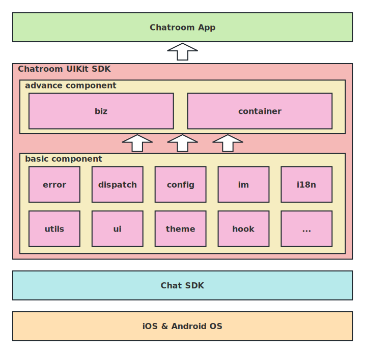

## 项目概述

该项目为 `Agora Chatroom UIKit SDK`, 简称 `UIKit`。在 `Agora Chat SDK` 基础上提供了聊天室 UI 组件的集合。可以帮助用户更快的搭建聊天室应用。

## 最低要求

使用该项目的要求：

- MacOS 12 或以上版本
- React-Native 0.66 或以上版本
- NodeJs 16.18 或以上版本

对于 `iOS` 应用：

- Xcode 13 或以上版本，以及它的相关依赖工具。

对于 `Android` 应用：

- Android Studio 2021 或以上版本，以及它的相关依赖工具。

## 项目结构

项目的主要结构如下：

```sh
.
├── biz // 含有业务的UI组件, 例如：聊天室一级组件、成员列表二级组件等。
├── config // 全局配置服务，例如：是否激活 `UIKit` 日志。
├── container // UIKit 入口 组件
├── dispatch // 事件分发服务，可以在联系紧密的组件间发送接收通知。
├── error // 错误对象，提供统一的错误码。
├── hook // Function组件工具，Class组件无法使用。
├── i18n // 国际化服务
├── im // Agora Chat SDK 服务，提供更加便捷的使用，提供统一的错误处理。
├── theme // 主题服务，提供light和dark主题，可以自定义基本色。
├── ui // 基础 UI 组件，其它高级组件的基础支撑，支持主题。
└── utils // 工具集合
```



## 命名约定

组件也是有多种分类的，根据 React-Native 的使用习惯，这里列举说明主要的命名约定。

- index.tsx 为对象的导出文件
- types.tsx 为类型声明的导出文件
- const.tsx 为常量文件，通常不对外
- Context：为数据共享的上下文对象。主题、国际化等都是通过该方式提供服务的。
- Provider：为数据共享的提供者对象
- Consumer：为数据共享的消费者对象
- Container：为 `UIKit` 的入口组件。集成了所有其他内部提供的服务和组件，使用者需要首先使用该组件进行初始化等操作。
- use 开头的：hook 工具，Function 组件使用，Class 组件不能使用。本 `UIKit` 主要以 `Function` 组件为主。
- 后缀 Props：为 UI 组件的参数类型
- 后缀 Memo：为 UI 组件的带缓存的类型
- 后缀 Ref：为 UI 组件的引用，可以控制组件行为。例如：获取焦点、显示模态窗口。
- 后缀 Model：为 UI 组件的参数里面的数据类型。
- 后缀 Service：为非 UI 组件。提供一定服务。例如：IMService。

## 快速开始

[portal](./quick-start.md)

## 组件概览

`Chatroom UIKit SDK` 的组件大体划分为 UI 组件和非 UI 组件。 UI 组件主要用来显示内容，非 UI 组件主要完成具体功能。
从使用者的角度来说可以分为直接使用的组件和间接使用的组件，例如，`Chatroom`组件是直接使用的组件，`MemberList`组件是间接使用的组件。
从组件构成的角度上说，组件又可以分为顶级组件、业务组件和基础组件。例如，`Chatroom` 组件就顶级组件，`MessageList`是业务组件，`SlideModal`是基础组件。
从组件的大小的角度又可以划分为页面级组件和非页面级组件。页面级组件会占用整个屏幕的大小。例如：`Chatroom`组件是页面级组件，其它为非页面级组件，
还有一类特殊的组件，他们无法和其它同类组件共存，他们是 `Modal`组件。
还有一些组件对约束是有要求的。例如：`ScrollView` 需要指定高度，或者父类有确定的高度。

// todo: 添加组件图

| UI 基础通用组件 | Function/Class   | 是否基础 | 是否页面 | 是否弹出 | 位置 | 大小 | 样式 | 控制 | 自定义 | 说明                                                |
| --------------- | ---------------- | -------- | -------- | -------- | ---- | ---- | ---- | ---- | ------ | --------------------------------------------------- |
| Text            | Function         | ✅       | ❌       | ❌       | ✅   | ✅   | ✅   | ❌   | ✅     | 文本基础组件：接近原生，支持主题                    |
| TextInput       | Function         | ✅       | ❌       | ❌       | ✅   | ✅   | ✅   | ✅   | ✅     | 文本输入基础组件：原生 android 无法符合设计要求     |
| TabPage         | Function         | ✅       | ❌       | ❌       | ✅   | ✅   | ✅   | ❌   | ❌     | tab 页面组件：原生没有,新增支持懒加载               |
| Modal           | Function         | ✅       | ❌       | ✅       | ✅   | ✅   | ✅   | ✅   | ✅     | 模态组件：原生不符合设计要求,增加非模态的相似组件。 |
| Image           | Function & Class | ✅       | ❌       | ❌       | ✅   | ✅   | ✅   | ❌   | ✅     | 图片组件：接近原生，自定义失败处理                  |
| Button          | Function         | ✅       | ❌       | ❌       | ✅   | ✅   | ✅   | ❌   | ❌     | 按钮组件：接近 Pressable，支持主题                  |
| FlatList        | Function         | ✅       | ❌       | ❌       | ✅   | ✅   | ✅   | ✅   | ✅     | 原生没有错误页面和加载页面。                        |

| UI 基础复合组件 | Function/Class | 是否基础 | 是否页面 | 是否弹出 | 位置 | 大小 | 样式 | 控制 | 自定义 | 说明                           |
| --------------- | -------------- | -------- | -------- | -------- | ---- | ---- | ---- | ---- | ------ | ------------------------------ |
| Alert           | Function       | ✅       | ❌       | ✅       | ❌   | ❌   | ❌   | ❌   | ❌     | 警告框组件：原生不符合设计要求 |
| Avatar          | Function       | ✅       | ❌       | ❌       | ✅   | ✅   | ✅   | ❌   | ❌     | 头像：如果失败，加载默认头像   |
| GiftIcon        | Function       | ✅       | ❌       | ❌       | ✅   | ✅   | ✅   | ❌   | ❌     | 礼物：如果失败，加载默认       |
| BottomSheetMenu | Function       | ✅       | ❌       | ✅       | ❌   | ❌   | ✅   | ✅   | ❌     | 上下文菜单：模态               |
| Placeholder     | Function       | ✅       | ❌       | ❌       | ✅   | ✅   | ❌   | ❌   | ❌     | 占位组件                       |
| EmojiList       | Function       | ✅       | ❌       | ❌       | ✅   | ✅   | ✅   | ❌   | ❌     | emoji 选择列表                 |
| GiftList        | Function       | ✅       | ❌       | ⭕️      | ✅   | ✅   | ❌   | ❌   | ❌     | 礼物选择列表                   |
| Marquee         | Function       | ✅       | ❌       | ❌       | ✅   | ✅   | ⭕️  | ✅   | ✅     | 消息广播组件                   |
| Report          | Function       | ✅       | ❌       | ⭕️      | ❌   | ❌   | ❌   | ✅   | ❌     | 消息上报组件                   |
| GiftEffect      | Function       | ✅       | ❌       | ❌       | ✅   | ❌   | ❌   | ✅   | ❌     | 礼物特效组件                   |

| UI 业务组件   | Function/Class | 是否基础 | 是否页面 | 是否弹出 | 位置 | 大小 | 样式 | 控制 | 自定义 | 说明                       |
| ------------- | -------------- | -------- | -------- | -------- | ---- | ---- | ---- | ---- | ------ | -------------------------- |
| InputBar      | Function       | ❌       | ❌       | ❌       | ❌   | ❌   | ❌   | ✅   | ❌     | 输入框组件                 |
| InputBarStyle | Function       | ❌       | ❌       | ❌       | ❌   | ❌   | ⭕️  | ✅   | ❌     | 输入框样式组件             |
| MemberList    | Function       | ❌       | ❌       | ⭕️      | ❌   | ❌   | ⭕️  | ✅   | ✅     | 成员列表组件               |
| MessageList   | Function       | ❌       | ❌       | ❌       | ✅   | ✅   | ⭕️  | ✅   | ✅     | 消息列表组件               |
| Chatroom      | Class          | ❌       | ✅       | ❌       | ❌   | ❌   | ⭕️  | ✅   | ✅     | 聊天室组件：所有组件的入口 |

说明：✅ 是 ❌ 否 ⭕️ 都可以

- 是否基础：UI 组件主要分为基础 UI 组件和业务 UI 组件。其中基础 UI 组件通用性更强，可以组成更复杂的组件。业务 UI 组件除了具有 UI，还包含一定的业务逻辑。
- 是否页面：独立的 UI 组件主要分为页面级 UI 组件和普通 UI 组件。页面级 UI 组件通常占用整个屏幕，可以在上面添加子组件。例如：Chatroom 组件就是页面级 UI 组件。
- 是否弹出：UI 组件处理交互的方式可以分为模态组件和非模态组件。模态组件需要处理完成当前的交互才可以进入下一个页面。目前 RN 模态仅支持但模态处理。android 是支持多模态处理的。
- 位置：组件支持调整位置，可以通过 flex 布局实现。flex 分为绝对布局和相对布局。
- 大小：组件支持大小调整。最大值、最小值和固定值。例如：maxHeight、minHeight、height。
- 样式：主要是指组件的颜色、margin、padding、border、color 等。
- 控制：可以主动调用组件提供的方法。通常组件通过用户的点击、拖动手势触发响应，但是输入框的焦点通常需要组件提供的方法来改变焦点。
- 自定义：通常使用调用者提供的自定义组件替换默认内置组件，实现最大化的自定义。

| List UI 组件 | 大小 | 是否为空 | 支持搜索 | 自定义 Item | 下拉刷新 | 触底加载 | 点击事件 | 长按事件 | 侧滑事件 | 自定义 | 空页面 | 错误页面 | 说明           |
| ------------ | ---- | -------- | -------- | ----------- | -------- | -------- | -------- | -------- | -------- | ------ | ------ | -------- | -------------- |
| EmojiList    | ✅   | ❌       | ❌       | ❌          | ❌       | ❌       | ✅       | ❌       | ❌       | ✅     | ❌     | ❌       | emoji 列表组件 |
| GiftList     | ✅   | ❌       | ❌       | ✅          | ❌       | ❌       | ✅       | ❌       | ❌       | ✅     | ❌     | ❌       | 礼物列表组件   |
| MemberList   | ✅   | ✅       | ✅       | ✅          | ✅       | ✅       | ✅       | ❌       | ❌       | ✅     | ✅     | ✅       | 成员列表组件   |
| MessageList  | ✅   | ✅       | ❌       | ✅          | ❌       | ❌       | ❌       | ✅       | ❌       | ✅     | ❌     | ❌       | 消息列表组件   |

说明：✅ 是 ❌ 否 ⭕️ 都可以

- 大小：参考上面。
- 是否为空：如果 List 没有数据，显示空页面。
- 支持搜索：支持搜索组件过滤列表项。
- 自定义 Item：通常使用调用者提供的自定义 Item 组件替换默认的组件，实现 Item 的自定义，包括手势事件、显示样式等。
- 下拉刷新：通过下拉刷新可以重置数据。
- 触底加载：通过触底触发更多数据加载。
- 点击事件：点击 Item 触发的事件。
- 长按事件：长按 Item 触发的事件。
- 侧滑事件：侧滑手势触发的事件。
- 自定义：参考上面

| 服务组件   | 使用 | 扩展 | 重载 | 自定义 | 说明         |
| ---------- | ---- | ---- | ---- | ------ | ------------ |
| config     | ✅   | ❌   | ❌   | ❌     | 全局配置选项 |
| dispatch   | ✅   | ❌   | ❌   | ❌     | 事件分发服务 |
| i18n       | ✅   | ✅   | ✅   | ❌     | 国际化服务   |
| im         | ✅   | ✅   | ✅   | ❌     | IM 服务      |
| log        | ✅   | ❌   | ❌   | ❌     | 日志服务     |
| permission | ✅   | ✅   | ✅   | ❌     | 权限服务     |
| theme      | ✅   | ❌   | ❌   | ❌     | 主题服务     |
| container  | ✅   | ❌   | ❌   | ❌     | 所有服务入口 |

说明：✅ 是 ❌ 否 ⭕️ 都可以

- 使用：仅仅提供初始化的配置项，或者不提供，通过使用组件提供的方法。
- 扩展：除了使用提供的，还可以扩展组件的功能。
- 重载：除了使用提供的，还可以覆盖掉原来组件的功能，提供不一样的结果。
- 自定义：除了使用、扩展、重载提供以外的方式方法。

| 其它组件 | 使用 | 扩展 | 重载 | 自定义 | 说明                              |
| -------- | ---- | ---- | ---- | ------ | --------------------------------- |
| error    | ✅   | ❌   | ❌   | ❌     | 提供 uikit 统一错误对象以及错误码 |
| hooks    | ✅   | ❌   | ❌   | ❌     | 自定义 hook                       |
| dev tool | ✅   | ❌   | ❌   | ❌     | 开发测试验证工具                  |
| utils    | ✅   | ❌   | ❌   | ❌     | 其它工具                          |

## 容器组件介绍

`Chatroom UIKit SDK` 的入口就是 `Container` 组件，它主要负责集成其他组件和参数配置。

```typescript
export type ContainerProps = React.PropsWithChildren<{
  appKey: string;
  isDevMode?: boolean;
  language?: StringSetType;
  languageFactory?: CreateStringSet;
  palette?: Palette;
  theme?: Theme;
  roomOption?: PartialRoomOption;
}>;
```

除了 `appKey` 之外都是可选参数。

- isDevMode: 如果设置为 `true`，则激活日志打印等工具。
- language: 设置当前的语言，如果没有设置，则获取系统当前的语言作为默认值。
- languageFactory: 如果没有设置则使用内置的语言资源。
- palette: 设置当前的调色板，主题服务的重要依赖。
- theme: 如果没有设置主题，将使用 `light` 为默认主题。
- roomOption: 聊天室选项。具体参见 全局配置服务。

通常 `Container` 会处于应用的底层，一般为根组件，或者是根组件同一级别。例如：

```typescript
export function App() {
  return <Container appKey={'your app key'}>{children}</Container>;
}
```

## 业务组件介绍

// todo: 配图，动图？

### MessageList

消息列表组件`MessageList`提供消息的显示，聊天室接收到的文本消息、表情消息、礼物消息，发送成功的消息会显示在这里。

消息列表可以对消息进行操作。例如：翻译文本消息为目标语言、撤销消息、消息上报等。 通过长按消息列表项弹出菜单进行相应操作。

数据上报组件支持自定义选项，可以自定义选项上报不同内容。

简单使用示例：

```typescript
// ...
// 创建组件引用对象
const ref = React.useRef<MessageListRef>({} as any);
// 添加消息列表组件到渲染树
<MessageList ref={ref} />;
// ...
// 添加消息到消息列表，消息会显示在列表
ref?.current?.addSendedMessage?.(message);
```

`MessageList`提供的属性概览

| 属性                     | 是否可选 | 介绍                                                            |
| ------------------------ | -------- | --------------------------------------------------------------- |
| visible                  | 可选     | 设置组件是否可见                                                |
| onUnreadCount            | 可选     | 未读数发生变化时的回调通知                                      |
| onLongPressItem          | 可选     | 长按消息列表项时的回调通知                                      |
| containerStyle           | 可选     | 设置组件容器样式。支持背景、位置、大小、边框等的设置            |
| onLayout                 | 可选     | 组件布局发生变化时的回调通知                                    |
| MessageListItemComponent | 可选     | 消息列表项的渲染器                                              |
| reportProps              | 可选     | 消息上报的属性                                                  |
| maxMessageCount          | 可选     | 组件可以显示的最大消息数，默认 1000，超过限制后将回收最早消息。 |

`MessageList`提供的方法概览

| 方法             | 介绍                             |
| ---------------- | -------------------------------- |
| addSendedMessage | 将输入框里面的内容发送到消息列表 |
| scrollToEnd      | 滚动消息列表到底部               |

### GiftEffect

礼物特效组件用来展示发送的礼物效果，礼物消息可以显示在消息列表，也可以显示在该组件。

简单使用示例：

```typescript
// ...
// 创建组件引用对象
const ref = React.useRef<GiftEffectRef>({} as any);
// 添加组件到渲染树
<GiftEffect ref={ref} />;
// ...
// 添加礼物消息到组件消息队列中，排队显示。
ref.current?.pushTask({
  model: {
    id: seqId('_gf').toString(),
    nickName: 'NickName',
    giftCount: '1',
    giftIcon: 'http://notext.png',
    content: 'send Agoraship too too too long',
  },
});
```

`GiftEffect`提供的属性概览

| 属性                    | 是否可选 | 介绍                                           |
| ----------------------- | -------- | ---------------------------------------------- |
| visible                 | 可选     | 设置组件是否可见                               |
| containerStyle          | 可选     | 设置组件容器样式。支持背景、位置、边框等的设置 |
| GiftEffectItemComponent | 可选     | 礼物特效列表项的渲染器                         |

`GiftEffect`提供的方法概览

| 方法     | 介绍                                 |
| -------- | ------------------------------------ |
| pushTask | 将礼物消息任务添加到队列中，排队加载 |

### Marquee

重要消息通知组件接收和现实全局重要消息。也是通过添加消息到队列排队显示。

简单示例如下：

```typescript
// ...
// 创建组件引用对象
const ref = React.useRef<MarqueeRef>({} as any);
// ...
// 添加组件到渲染树
<Marquee ref={ref} />;
// ...
// 将消息添加到任务队列，排队显示。
let count = 1;
ref.current?.pushTask?.({
  model: {
    id: count.toString(),
    content: count.toString() + content,
  },
});
```

`Marquee`提供的属性概览

| 属性                    | 是否可选 | 介绍                                                 |
| ----------------------- | -------- | ---------------------------------------------------- |
| visible                 | 可选     | 设置组件是否可见                                     |
| playSpeed               | 可选     | 消息播放时滚动的速度，默认值 8                       |
| containerStyle          | 可选     | 设置组件容器样式。支持背景、位置、大小、边框等的设置 |
| textStyle               | 可选     | 设置组件文本样式                                     |
| icon                    | 可选     | 设置组件上的图标样式                                 |
| GiftEffectItemComponent | 可选     | 礼物特效列表项的渲染器                               |
| onFinished              | 可选     | 所有消息播放完成时的回调通知                         |
| onLayout                | 可选     | 组件布局发生变化时的回调通知                         |

`Marquee`提供的方法概览

| 方法     | 介绍                         |
| -------- | ---------------------------- |
| pushTask | 将消息添加到队列中，排队加载 |

### InputBar

输入框组件可以发送文本、表情消息。 同时和 输入框组件组合为可以动态切换的组件。当点击输入框样式组件时切换到输入状态，发送消息或者关闭输入框时切换为输入框样式组件。

简单示例如下：

```typescript
// ...
// 创建引用对象
const ref = React.useRef<InputBarRef>({} as any);
// ...
// 添加组件到渲染树
<InputBar
  ref={ref}
  onSended={(_content, message) => {
    // todo: 调用消息列表引用对象添加消息到消息列表
  }}
/>;
// ...
// 关闭输入状态
ref?.current?.close?.();
```

`InputBar`提供的属性概览

| 属性                   | 是否可选 | 介绍                                          |
| ---------------------- | -------- | --------------------------------------------- |
| onInputBarWillShow     | 可选     | 将要切换为输入状态时的回调通知                |
| onInputBarWillHide     | 可选     | 将要切换为输入样式状态时的回调通知            |
| onSended               | 可选     | 发送完成时的回调通知                          |
| keyboardVerticalOffset | 可选     | 键盘偏移量的数值                              |
| closeAfterSend         | 可选     | 发送消息后是否切换为输入样式状态              |
| first                  | 可选     | 输入样式组件的第一个自定义组件                |
| after                  | 可选     | 输入样式组件的后面的自定义组件列表，最多 3 个 |
| onLayout               | 可选     | 输入样式组件布局发生变化时的回调通知          |

`InputBar`提供的方法概览

| 方法  | 介绍                                 |
| ----- | ------------------------------------ |
| close | 主动关闭输入状态，切换为输入样式状态 |

### InputBarStyle

输入样式组件。和输入框组件组成了复合组件，可以动态进行切换。

### BottomSheetMemberList

聊天室成员组件可以显示和管理聊天室成员，房间拥有者还有禁言列表以及管理权限。

房间拥有者可以更改成员状态。例如：对某个成员禁言，将某个成员踢出聊天室。

**注意** 聊天室成员列表组件的显示的入口并不在 `UIKit`, 所以，需要应用开发者自行实现。例如：添加一个按钮点击触发显示聊天室成员列表组件。

简单示例如下：

```typescript
// ...
// 创建引用对象
const ref = React.useRef<BottomSheetMemberListRef>({} as any);
// ...
// 添加组件到渲染树
<BottomSheetMemberList ref={ref} />;
// ...
// 显示聊天室成员列表
ref?.current?.startShow?.();
```

`BottomSheetMemberList`提供的属性概览

| 属性                | 是否可选 | 介绍                                                 |
| ------------------- | -------- | ---------------------------------------------------- |
| containerStyle      | 可选     | 设置组件容器样式。支持背景、位置、大小、边框等的设置 |
| maskStyle           | 可选     | 设置组件容器以外区域样式。                           |
| onSearch            | 可选     | 点击搜索样式按钮时的回调通知                         |
| onNoMoreMember      | 可选     | 上滑手势加载更多数据，没有更多数据时的回调通知       |
| MemberItemComponent | 可选     | 成员列表项的渲染器                                   |

`BottomSheetMemberList`提供的方法概览

| 方法      | 介绍                                     |
| --------- | ---------------------------------------- |
| startShow | 显示成员列表组件                         |
| startHide | 隐藏成员列表组件，隐藏动画完成后返回通知 |

### BottomSheetGift

礼物列表组件提供自定义礼物列表，点击礼物项的发送按钮发送到聊天室。

**注意** 礼物列表组件是一个独立的组件，需要应用开发者自行实现显示和加载等操作。

简单示例如下：

```typescript
// ...
// 创建引用对象
const ref = React.useRef<BottomSheetGiftSimuRef>({} as any);
// ...
// 添加组件到渲染树
<BottomSheetGift2
  ref={ref}
  gifts={[
    {
      title: 'gift1',
      gifts: [
        {
          giftId: '2665752a-e273-427c-ac5a-4b2a9c82b255',
          giftIcon:
            'https://fullapp.oss-cn-beijing.aliyuncs.com/uikit/pictures/gift/AUIKitGift1.png',
          giftName: 'Sweet Heart',
          giftPrice: 1,
        },
      ],
    },
  ]}
  onSend={(giftId) => {
    // todo: 发送选择的礼物。
  }}
/>;
// ...
// 显示礼物列表组件
ref?.current?.startShow?.();
```

`BottomSheetGift2`提供的属性概览

| 属性      | 是否可选 | 介绍                       |
| --------- | -------- | -------------------------- |
| gifts     | 可选     | 礼物列表数组               |
| maskStyle | 可选     | 设置组件容器以外区域样式。 |
| onSend    | 可选     | 点击发送按钮时的回调通知   |

`BottomSheetGift2`提供的方法概览

| 方法              | 介绍                                     |
| ----------------- | ---------------------------------------- |
| startShow         | 显示成员列表组件                         |
| startShowWithInit | 显示成员列表组件，同时可以初始化列表     |
| startHide         | 隐藏成员列表组件，隐藏动画完成后返回通知 |

### Chatroom

聊天室组件是包括成员列表组件、输入组件、消息列表组件、礼物特效组件、重要消息通知组件、菜单组件等的集合。它是一个页面级组件，基本占据了这个屏幕。如果想要添加组件，建议成为它的子组件或者背景组件。

简单示例如下：

```typescript
// ...
// 创建引用对象
const ref = React.useRef<Chatroom>({} as any);
// ...
// 添加组件到渲染树
<Chatroom ref={chatroomRef} roomId={room.roomId} ownerId={room.owner} />;
```

由于 `UIKit` 没有路由 （`React-Native` 没有内置），所以，这里如果需要进行成员搜索，需要像下面这样设置。

```typescript
<Chatroom
  ref={chatroomRef}
  memberList={{
    props: {
      onSearch: (memberType) => {
        // todo: 点击搜索按钮跳转到搜索页面
        navigation.push('TestSearchMember', { params: { memberType } });
      },
    },
  }}
  roomId={room.roomId}
  ownerId={room.owner}
/>
```

`Chatroom`提供的属性概览

| 属性           | 是否可选 | 介绍                                                 |
| -------------- | -------- | ---------------------------------------------------- |
| containerStyle | 可选     | 设置组件容器样式。支持背景、位置、大小、边框等的设置 |
| GiftEffect     | 可选     | 礼物特效组件的渲染器                                 |
| Marquee        | 可选     | 重要消息组件的渲染器                                 |
| input          | 可选     | 输入组件的属性                                       |
| messageList    | 可选     | 消息列表的属性                                       |
| marquee        | 可选     | 重要消息的属性                                       |
| gift           | 可选     | 礼物特效的属性                                       |
| memberList     | 可选     | 成员列表的属性                                       |
| backgroundView | 可选     | 背景组件                                             |

`Chatroom`提供的方法概览

| 方法              | 介绍                           |
| ----------------- | ------------------------------ |
| getMarqueeRef     | 获取`Marquee`的组件引用        |
| getGiftEffectRef  | 获取`getGiftEffect`的组件引用  |
| getMemberListRef  | 获取`getMemberList`的组件引用  |
| getMessageListRef | 获取`getMessageList`的组件引用 |
| joinRoom          | 加入聊天室                     |
| leaveRoom         | 退出聊天室                     |

## 主题介绍

每个 UI 组件都会用到主题，主题服务提供了`light`和`dark`主题。支持一键切换。

简单示例如下：

```typescript
// ...
// 定义主题设置状态
const palette = usePresetPalette();
const dark = useDarkTheme(palette);
const light = useLightTheme(palette);
const [theme, setTheme] = React.useState(light);
// ...
// 添加组件到渲染树
<Container appKey={env.appKey} palette={palette} theme={theme} />;
// ...
// 更改主题设置
setTheme(theme === light ? dark : light);
```

## 国际化介绍

UIKit 支持多国语言切换，目前内置中文和英文。支持扩展其他语言。

如果没有设置语言，则使用默认系统语言，如果系统语言不是中文或者英文，则国内选择中文，国外选择英文。
如果设置语言不是中文或者英文，并且没有提供相应的语言集合，则国内选择中文，国外选择英文。

简单示例如下：

```typescript
<Container appKey={env.appKey} language={'en'} />
```

使用扩展语言集合示例如下：

```typescript
// ...
// 创建指定语言集合
function createLanguage(type: LanguageCode): StringSet {
  console.log('test:zuoyu:createLanguage:', type);
  if (type === 'fr') {
    return {
      'French text.': 'Texte français.',
    };
  }
  return {
    'French text.': 'French text.',
  };
}
// ...
// 设置指定语言集合，并且提供语言翻译源
<Container
  appKey={env.appKey}
  language={'fr'}
  languageFactory={createLanguage}
/>;
```

## 更多

// todo: 后续补充
