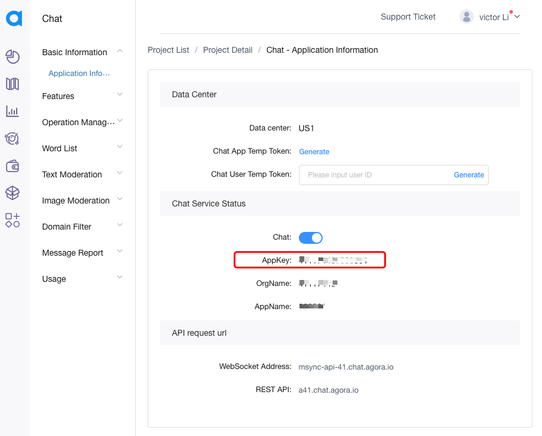
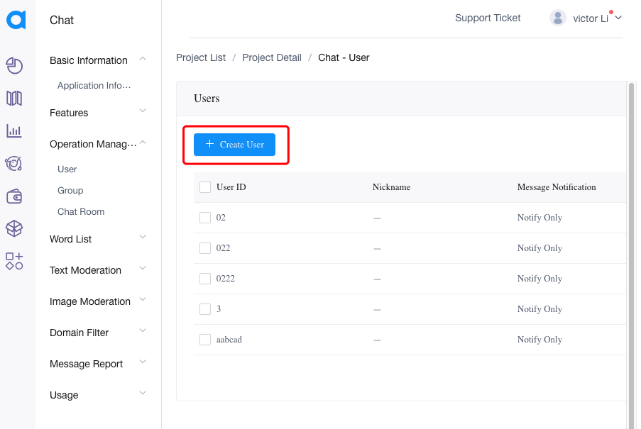
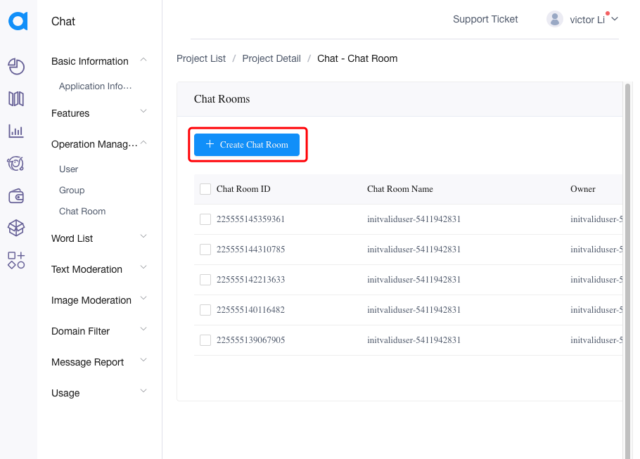

### 准备

#### 获取 appKey

通过官网注册应用，获取 appKey。如图所示：



#### 创建账号

通过官网的控制台可以创建用户，如图所示：



#### 创建聊天室

通过官网的控制台可以穿件聊天室，如图所示：



### 初始化

初始化需要填写必要的参数和配置，将`Container`放在组件树的根部。

```tsx
export function App() {
  const appKey = '<your app key>';
  return <Container appKey={appKey}>{/* // todo: 在这里添加组件 */}</Container>;
}
```

### 登录

登录服务器是进入聊天室的必要前提条件。

```tsx
// ...
// 获取 IM 服务对象
const im = useIMContext();
// ...
// 登录服务
// userId、userToken、userNickname 为必填项
im.login({
  userId: '<user ID>',
  userToken: '<user token>',
  userNickname: '<user nick name>',
  userAvatarURL: '<user avatar url>',
  gender: 1,
  identify: '<user custom data>',
  result: ({ isOk, error }) => {
    // todo: isOk === true 用户登录成功
    // todo: isOk === false 用户登录失败
  },
});
```

### 进入聊天室

进入聊天室之前，需要获取聊天室 ID 和 创建者 ID。 这些可以通过调用 `im.fetchChatroomList` 获取到。

通过加载 `Chatroom` 组件，组件会自动加入聊天室，并且给出返回结果，如果加载失败，可以手动尝试。

```tsx
// ...
// 创建组件引用对象
const chatroomRef = React.useRef<Chatroom>({} as any);
// ...
// 关注组件状态变化
useIMListener(
  React.useMemo(() => {
    return {
      onError: (params) => {
        // todo: 失败通知处理。错误类型可以参考 UIKitError
        // todo: 例如：被踢出房间，可以重新加入。chatroomRef.current?.joinRoom({roomId, ownerId}});
      },
      onFinished: (params) => {
        // todo: 该通知会收到关键的完成结果。例如：加入聊天室之后收到通知。类型可以参考 IMEventType
      },
    };
  }, [])
);
// ...
// 加载组件到渲染树
<Chatroom ref={chatroomRef} roomId={room.roomId} ownerId={room.owner} />;
// ...
```
